# Table of Contents

[TOC]

# Introduction

**Workflow Orchestrator** is a platform to programmatically author, schedule, and monitor workflows.

When workflows are defined as code, they become more maintainable, version-able, testable, and collaborative.

Use this orchestrator to author workflows as directed acyclic graphs (DAGs) of tasks. The orchestrator scheduler executes your tasks on an array of workers while following the specified dependencies. Basically, it helps to automate scripts in order to perform tasks.

The rich user interface makes it easy to visualize pipelines running in production, monitor progress, and troubleshoot issues when needed.


# Release Notes


- Base Airflow Version: `1.10.10.`
- Support for LDAP Authentication and DB Authentication.
- Support for `Configuration Groups` .
- Support for `Spark & Hadoop Clusters`.
- Support for `Jupyterhub` & submitting `Spark Jobs` from `Jupyterhub` using `Livy`.
- Support for `Tensorflow Serving`.

# Installation

**Prerequisites** : `Docker` and `Docker-compose` should be installed.

## Installing workflow orchestrator (with Internet)

-   **Fetching the dependencies**:
    -   Get the `docker-compose.yml` file from shared artifacts.
-   **Running orchestrator**:
    -   Go to the directory where `docker-compose.yml` file is located.
    -   Run the following command:
        - `sudo COUTURE_WORKFLOW_USER=<your name> docker-compose up -d worker`

## Installing workflow orchestrator (without Internet)

-   Configuring to access private docker registry:

-   Add the following entry to `/etc/hosts` : `10.144.97.22 CR1`

- Change `/etc/docker/daemon.json` file to add the following properties:

  ```json
  {
    "insecure-registries" : ["CR1:5005"]
  }
  ```

  If `/etc/docker/daemon.json` is not present, create and add the configuration assuming there are no other settings.

- Restart the docker daemon after updating the configurations:

  `sudo systemctl restart docker`

- Fetching the dependencies:

  Run the following commands to pull the images from private registry:

  `docker pull CR1:5005/rabbitmq:3.7-management`

  `docker pull CR1:5005/mysql:5.7`

  `docker pull CR1:5005/couture-workflow:1.0`

- Tag the images

  `docker tag CR1:5005/rabbitmq:3.7-management rabbitmq:3.7-management`

  `docker tag CR1:5005/mysql:5.7 mysql:5.7`

  `docker tag CR1:5005/couture-workflow:1.0 couture-workflow`

- **Fetching the dependencies**:

  - Get the `docker-compose.yml` file from shared artifacts.

- **Running orchestrator**:

  - Go to the directory where `docker-compose.yml` file is located.
  - Run the following command:
    - `sudo COUTURE_WORKFLOW_USER=<your name> docker-compose up -d worker`

  - Note that `COUTURE_WORKFLOW_USER` is optional and can be used to have personalized `dags` view.

Go to `http://<HOST>:8080`  to start the orchestrator, where `<HOST>` refers to the hostname of the server. For example, `http://localhost:8080 `.

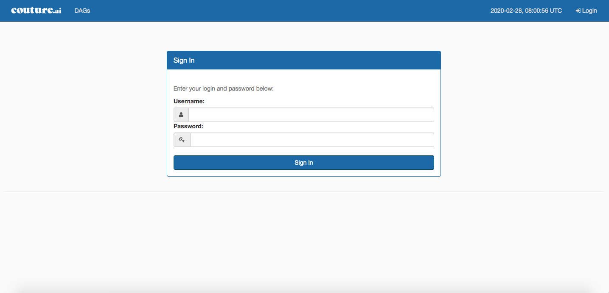


**NOTE**: `RBAC (Role based access control)` is used to provide security. Workflow is shipped with a *user*  `superadmin` whose *password* is `couture@123`.

One can change the password by going to top right corner of Navigation bar, then clicking on :

`Super Admin`  -\> `Reset my password` -\> `Save`.


# Getting Started


**Login as an admin user and configure spark and hadoop configurations as follows.**

## Spark Configurations and Dependencies

Easily configure spark jobs by providing options through orchestrator using below steps:

1.  In the top navigation bar, go to `Admin` -\>` Spark Configuration`.

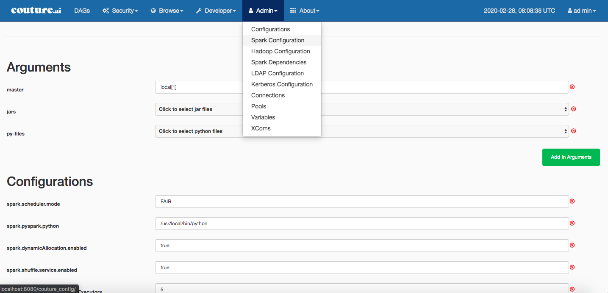

2. Update existing arguments/configurations or add new ones by clicking on `Add in` buttons. Existing options can be deleted by clicking on delete option, next to the option.
3. Available jars to include on the driver and executor classpaths are listed under `jars` option. Similarly, available list of `.zip`, `.egg`, or ` .py` files to place on the `PYTHONPATH` for Python apps are listed under `py`-files. To upload/delete these jars or python files, visit, `Admin` -\> `Spark Dependencie`s. Upon uploading new `jars`/`python` files under `Spark Dependencies`, the same will be added to respective dropdown here.

**Note**: New changes gets automatically picked up for all the *NEWLY* triggered spark jobs.

4. For `pyspark` jobs, to set python for the cluster (executors), in case python environment is required, configuration `spark.yarn.appMasterEnv.PYSPARK_PYTHON` can be added under `Spark Configuration` tab and same can be referred in individual workflow task by using `python_conf` attribute.

## Hadoop Configurations

Configurations files required for runtime environment settings of a hadoop cluster can be easily configured  with the help of `Hadoop Configuration Groups` through orchestrator using below steps:

In the top navigation bar, go to `Admin` -\> `Hadoop Configuration`.

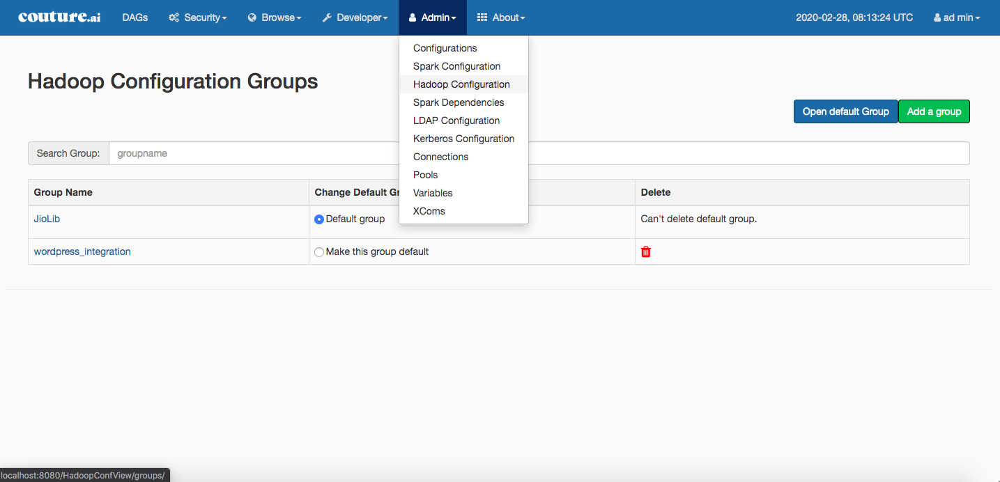

1. When you are running `Workflow` for the first time, there will not be any `config groups`. However, you can create a config group by clicking on `Add a group` button.

   

2. Once, you have successfully added the first group, it will be made as the `default` group. In the groups list, you can click on a group to see its configuration files.

   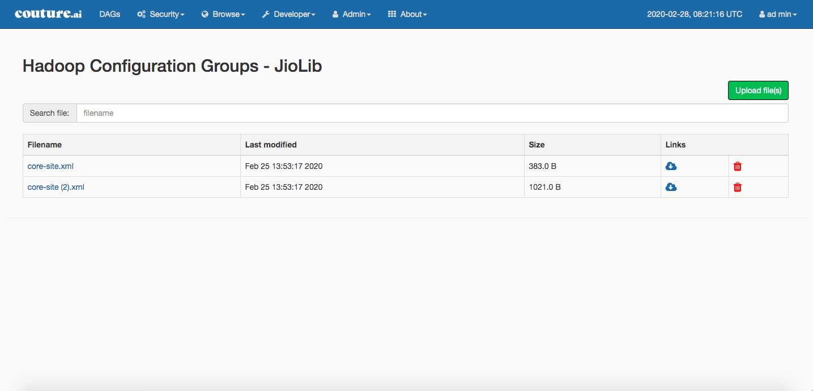

3. New `hadoop conf` files can be added to that group using `Upload file(s)` option. Please note that only XML files are allowed.

4. The configurations within a file can be updated by clicking on the respective file name.

   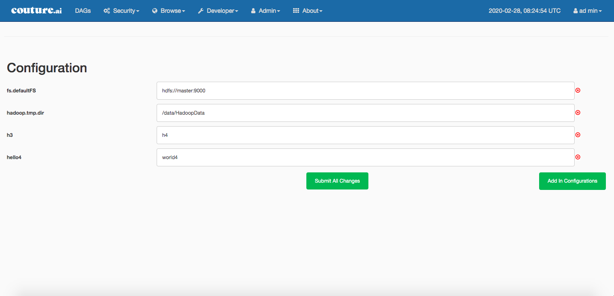

## Kerberos Configurations

Configurations for kerberos enabled hadoop clusters can be done by following the below steps:

1. In the top navigation bar, go to `Admin` -\> `Kerberos Configuration`.

2. Upload the `keytab` file from `Upload Keytab File` option. These configurations, if added, are automatically applied to the spark jobs.

   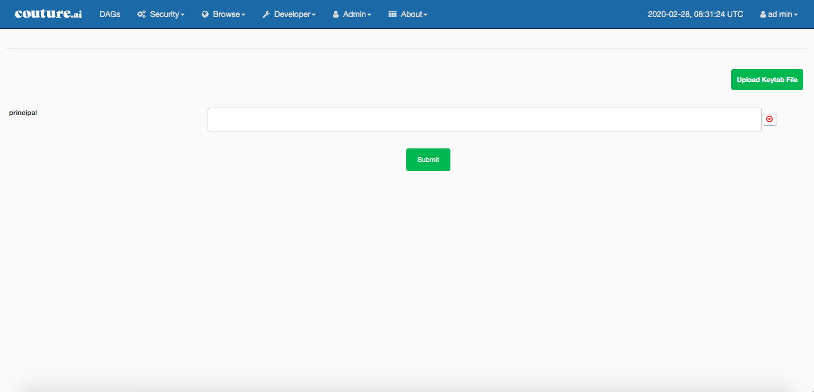

## LDAP Configurations

Configurations required for ldap can be done by following the below steps:

1. In the top navigation bar, go to `Admin` -\>` Ldap Configuration`.

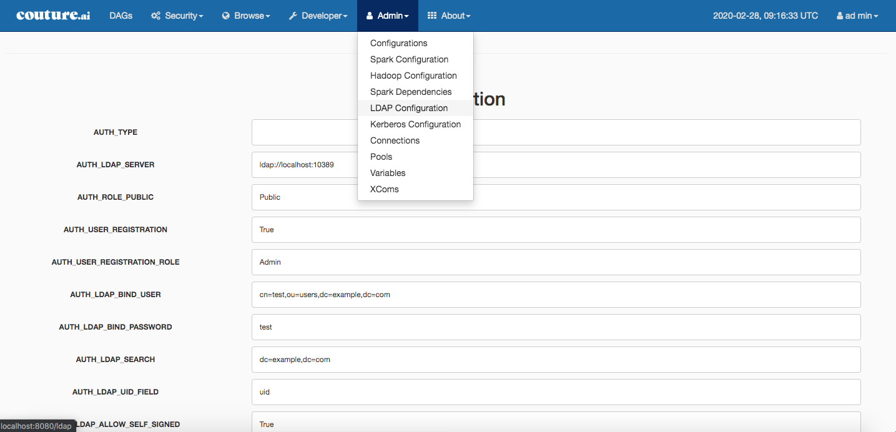

**Note: For configuration changes to reflect, run "docker-compose down" and restart the containers again.**

| Config                        | Description                                                  |
| ----------------------------- | :----------------------------------------------------------- |
| `AUTH_TYPE`                   | Set to `AUTH_LDAP`. This overrides the default setting, which is to use the MySQL database for authentication. Henceforth, only LDAP users will be able to login to workflow. |
| `AUTH_LDAP_SERVER`            | The address of the `LDAP` server, for example `ldap://<ip_address>`, or `ldaps://<ip_address>` to connect to a secure `LDAP` server. If a secure ` LDAP`` server is used, the AUTH_LDAP_USE_TLS` property must be set to false. |
| `AUTH_LDAP_SEARCH`            | The base `dn` that will be used when searching for a user, for example: `ou=Users,dc=local,dc=company,dc=com` |
| `AUTH_LDAP_UID_FIELD`         | The name of the field that contains the username value. The domain name is not included in this field. For example, `sAMAccountName`. |
| `AUTH_LDAP_BIND_USER`         | A generic search account to be used when searching for a user in a bind request, For example: `cn=Search User,ou=Users,dc=local,dc=company,dc=com` |
| `AUTH_LDAP_BIND_PASSWORD`     | A generic password to supply in a bind request, For example: `SearchPassword1` |
| `AUTH_LDAP_ALLOW_SELF_SIGNED` | Set this to `True` to allow self-signed signatures to be used with `TLS`. |
| `AUTH_LDAP_GROUP_SEARCH`      | The base `dn` that will be used when searching for a group, For example, `ou=Groups,dc=local,dc=company,dc=com` |
| `AUTH_LDAP_USE_TLS`           | Set this to `True` to use Transport Layer Security. If this is set to `True` then the `AUTH_LDAP_SERVER` address must be of a standard `LDAP `server rather than a secure `LDAP` server. |
| `AUTH_LDAP_FIRSTNAME_FIELD`   | Default to `givenName` will use `MSFT AD` attribute to register `first_name` on the `db`. |
| `AUTH_LDAP_EMAIL_FIELD`       | Default to `mail` will use `MSFT AD` attribute to register `email` on the `db`. If this attribute is null |
| `AUTH_LDAP_LASTTNAME_FIELD`   | Default to `sn` will use `MSFT AD` attribute to register `last_name` on the `db`. |
| `AUTH_USER_REGISTRATION`      | Set to `True` to enable user self registration.              |
| `AUTH_USER_REGISTRATION_ROLE` | Set role name, to be assign when a user registers himself. This role must already exist. Mandatory when using user registration. |
| `AUTH_LDAP_TLS_DEMAND`        | Demands `TLS` peer certificate checking (`Bool`)             |
| `AUTH_LDAP_SEARCH_FILTER`     | Filter or limit allowable users from the `LDAP` server, e.g., only the people on your team. `AUTH_LDAP_SEARCH_FILTER` = `(memberOf=cn=group name,OU=type,dc=ex ,cn=com)` |
| `AUTH_LDAP_APPEND_DOMAIN`     | Append a domain to all logins. No need to use`john@domain.local`. Set it like: `AUTH_LDAP_APPEND_DOMAIN` = `domain.local` And the user can login using just `john`. |
| `AUTH_LDAP_USERNAME_FORMAT`   | It converts `username` to specific format for `LDAP` authentications. For example, when `username` = `userexample` & `AUTH_LDAP_USERNAME_FORMAT`=`format-%s`, It authenticates with `format-userexample`. |
| `AUTH_LDAP_TLS_CACERTDIR`     | CA Certificate directory to check peer certificate.          |
| `AUTH_LDAP_TLS_CACERTFILE`    | CA Certificate file to check peer certificate.               |
| `AUTH_LDAP_TLS_CERTFILE`      | Certificate file for client auth use with `AUTH_LDAP_TLS_KEYFILE` |
| `AUTH_LDAP_TLS_KEYFILE`       | Certificate key file for `client` auth.                      |

## Livy Configuration

<a name="livy-configuration"></a>

 [Livy](https://livy.incubator.apache.org/) enables programmatic, fault-tolerant, multi-tenant submission of Spark jobs from web/mobile apps. To configure default endpoints of sparkmagic kernels present in Jupyterhub, Admin will have to configure Livy Endpoints. To configure `Livy` from the UI, go to (`Admin`->`Livy Configuration`).

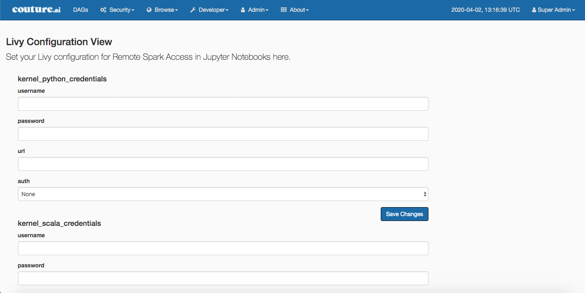

## Git Configuration

Developers can configure Workflow Orchestrator to connect their JupyterHub files to a remote repository and perform common git operators such as commiting files, pushing to remote repository, viewing logs etc.

To connect the remote repository, from the UI, go to (Developer -> Git Configuration) and enter the details.

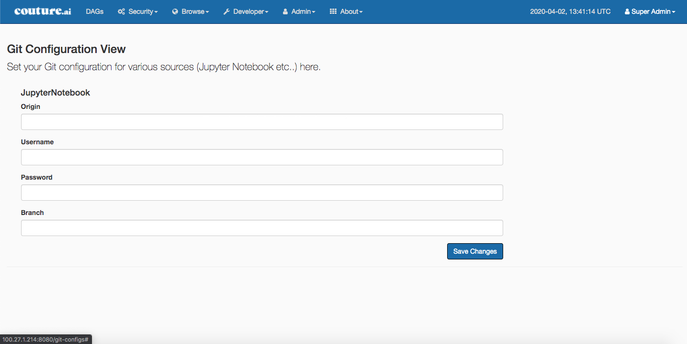


After saving the files, they can execute common git actions via the `Git Actions` button in (`Developer`->`Jupyter Notebook`) View.

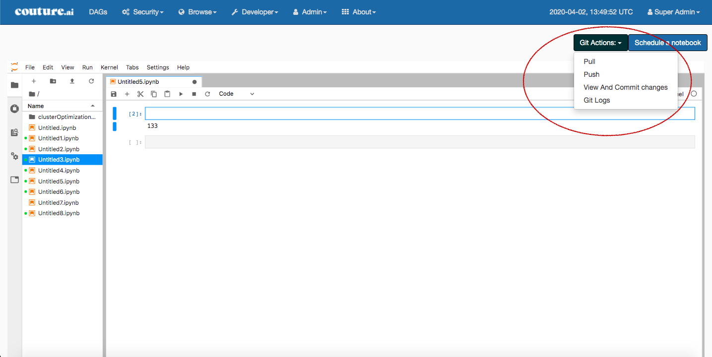


## Code Artifacts

To upload artifacts i.e. either your jar code for spark jobs or python files for py-spark jobs.

1. In the top navigation bar, go to `Developer` ->` Code Artifacts`.

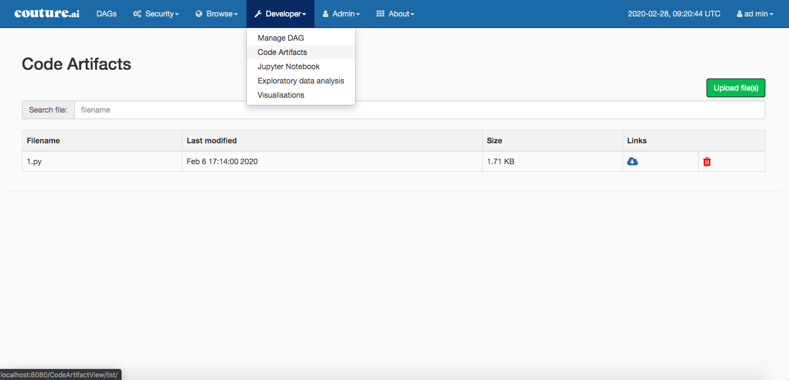

The `artifacts` can be referred in your `dag` while creating tasks under `code_artifact` attribute as shown below:

```python
Get_Ratings_History = CouturePySparkOperator(
    task_id='Get_Ratings_History',
    app_name=appName,
    code_artifact='PySpark.py',
    application_arguments=[],
    dag=dag,
    description='Get ratings history'
)
```

## What is DAG?

In mathematics and computer science, a directed acyclic graph, is a finite directed graph with no directed cycles. That is, it consists of finitely many vertices and edges, with each edge directed from one vertex to another, such that there is no way to start at any vertex v and follow a consistently-directed sequence of edges that eventually loops back to v again. Equivalently, a `DAG` is a directed graph that has a topological ordering, a sequence of the vertices such that every edge is directed from earlier to later in the sequence.

`DAG's` are composed of tasks which are created by instantiating an **operator** class.

There are different types of operators available.

*Example:*

```python
from datetime import datetime, timedelta

from airflow import DAG
from airflow.operators import CouturePySparkOperator

appName = 'FunWithPySpark'

default_args = {
   'owner': 'couture',
   'depends_on_past': False,
   'start_date': datetime(2018, 10, 8),
   'retries': 1,
   'retry_delay': timedelta(minutes=5),
}

schedule = None
dag = DAG('PySpark', default_args=default_args, catchup=False, schedule_interval=schedule)

Get_Ratings_Data = CouturePySparkOperator(
    task_id='Get_Ratings_Data',
    app_name=appName,
    code_artifact='Ratings.py',
    application_arguments=[],
    dag=dag,
    description='Dump ratings data in hdfs'
)

Get_Ratings_History = CouturePySparkOperator(
    task_id='Get_Ratings_History',
    app_name=appName,
    code_artifact='History.py',
    application_arguments=[],
    dag=dag,
    description='Get ratings history'
)

Get_Ratings_Data >> Get_Ratings_History

```

## Creating a DAG

### Importing Modules

An orchestrator `pipeline` is just a` Python` script that happens to define a `DAG` object. Let's start by importing the libraries we will need.

```python
# The DAG object; we'll need this to instantiate a DAG
from airflow import DAG
# Operators; we need this to operate!
from airflow.operators.bash_operator import BashOperator
```

To create `spark` and `pyspark` jobs, import operators `CoutureSparkOperator` and `CouturePySparkOperator` respectively.

```python
from airflow.operators import CoutureSparkOperator
```


### Default Arguments

We're about to create a `DAG` and some tasks, and we have the choice to explicitly pass a set of arguments to each task's constructor (which would become redundant), or (better!) we can define a dictionary of default `parameters` that we can use when creating tasks.

```python
from datetime import datetime, timedelta
default_args = {
    'owner': 'couture',
    'depends_on_past': False,
    'start_date': datetime(2015, 6, 1),
    'email': ['couture@example.com'],
		'email_on_failure': False,
    'email_on_retry': False,
    'retries': 1
}

```


- `start_date` tells since when this `DAG` should start executing the workflow. This `start_date` could be a day which has already passed.

- The `retries` parameter retries to run the `DAG` `X` number of times in case of not executing successfully. 

**Note:** You could easily define different sets of arguments that would serve different purposes. An example of that would be to have different settings for production and development environment.

### Instantiate a DAG

We'll need a `DAG` object to nest our tasks into. Here we pass a string that defines the `dag_id`, which serves as a unique identifier for your `DAG`. We also pass the default argument dictionary that we just defined and define a `schedule_interval` of 1 day for the `DAG`.

```python
dag = DAG('dag',
					default_args=default_args,
					schedule_interval=timedelta(days=1))

```

Workflow consists of a `scheduler` which is monitoring process that runs all the time and triggers task execution based on `schedule_interval` and `execution_date`.

### Tasks

`Tasks` are generated when instantiating operator objects. An object instantiated from an operator is called a constructor. The first argument `task_id` acts as a unique identifier for the task.

Task description describing its functionality can be added using `description` attribute.

```python
t1 = BashOperator(
  task_id = 'print_date',
  bash_command = 'date',
  dag = dag,
  description = ‘Print Date’)
```

```python
operator_task = CoutureSparkOperator(
    task_id = 'operator_task',
    dag = dag,
    app_name = 'Couture',
    class_path = 'ai.couture.MainClass',
    code_artifact = 'couture.jar',
    application_arguments = ['inputData', '/outputData'],
      description = ''
    )

```


### Setting up Dependencies

We have tasks *t1*, *t2* and *t3* that do not depend on each other. Here's a few ways you can define dependencies between them:

```python
t1.set_downstream(t2)
# This means that t2 will depend on t1
# running successfully to run.

# It is equivalent to:
t2.set_upstream(t1)

# The bit shift operator can also be
# used to chain operations:
t1 >> t2

# And the upstream dependency with the
# bit shift operator:
t2 << t1

# Chaining multiple dependencies becomes
# concise with the bit shift operator:
t1 >> t2 >> t3

# A list of tasks can also be set as
# dependencies. These operations
# all have the same effect:
t1.set_downstream([t2, t3])
t1 >> [t2, t3]
[t2, t3] << t1

```

**Note:** that when executing your *script*, orchestrator will raise `exceptions` when it finds cycles in your `DAG` or when a dependency is referenced more than once.

## Adding a new DAG

After creating a `<dag>.py` file on your local machine, add the new ` dag` to server using below steps:

-   In the top navigation bar, go to `Developer` -\> `Manage DAGs`.
-   Click on `Upload DAG file(s)` and select `<dag>.py` file.

For creating a new `<dag>.py` file directly on the server, follow the below steps:

- In the top navigation bar, go to `Developer` -\> `Manage DAGs`.
  - Click on `Create New Dag` and fill in the `Name` of the `dag`. Then click `Add`. You will be redirected to ` Edit DAG` page. Note that `DAG` will only be created once you save the `DAG` content in `Edit DAG Code` page.

**Note:** Only `*.py` format is supported.

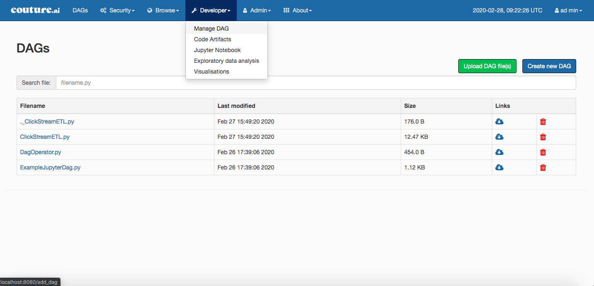

## Edit DAG code

If you have an existing dag added to the orchestrator, you can edit the same using below steps:

- In the top navigation bar, go to `Developer` -> `Manage DAGs`

- Search your `dag` from the search bar and click on it.

- Make the necessary changes, Click on `Review & Save` button. You will be shown you changes, which you can `revert` if you are unhappy with them. Click on `Save Code` to finally save the `dag`.

- One can review the new changes before saving.

  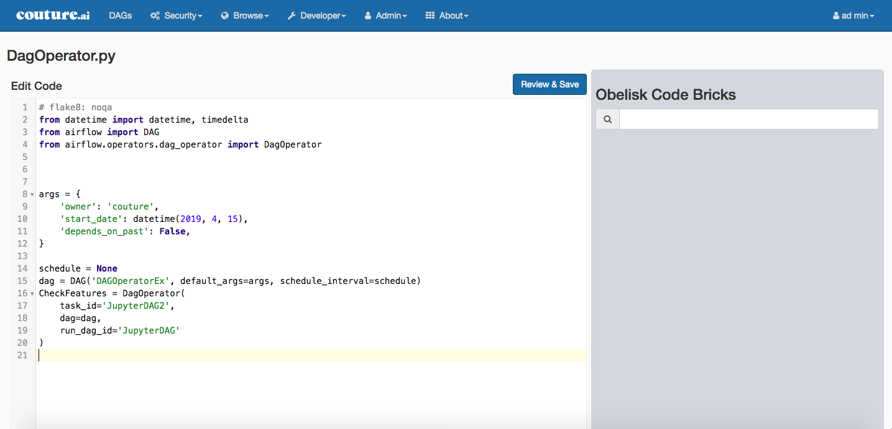

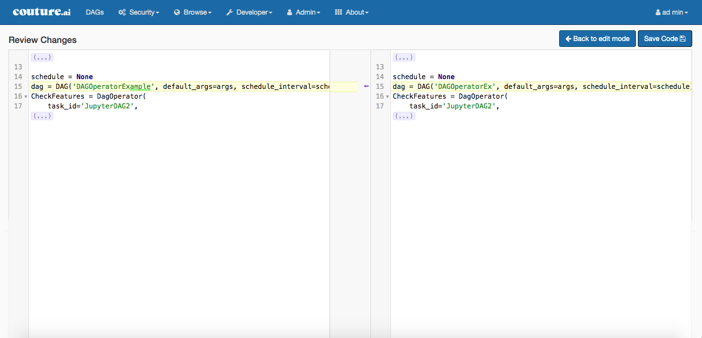

## Code Bricks

`Dags` can be added/edited by visiting, `Developer` -\> ` Manage DAGs`.

- Existing `code bricks` (code snippets) can be added to the `dags`, by visiting the `Code Bricks` repository and inserting the required code.

- New snippets can also be added by `Add a new code brick` option. Please note the `title` entered here, appears in the list.

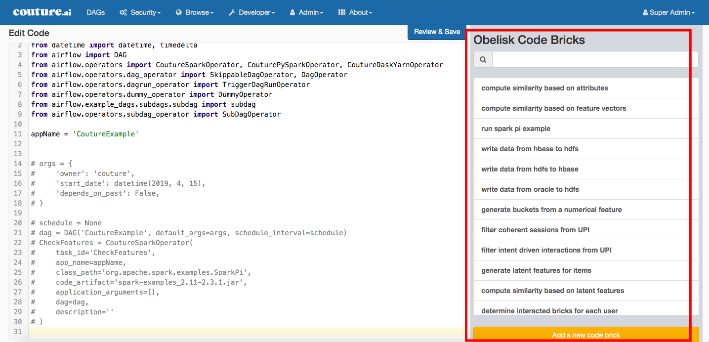

## Run DAG

The **Scheduler** is responsible at what time `DAG` should be triggered. By default all the `dags` are paused to be scheduled.

Also, please note that all the paused `dags` are hidden by default. To un-pause the dag, click on the `Show Paused DAGs` and switch `ON` the required dag.

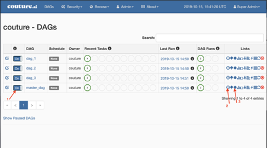

In order to start a `DAG` Run, first turn the `dag` `ON` (arrow **1**), then click the **Trigger Dag** button (arrow **2**) and finally, click on the **Graph View** (arrow **3**) to see the progress of the run.

The graph view can be reloaded until all the `tasks` reach the status **Success**. You can also click on a `task` and then click **View Log** to see the log of task instance run.

## Master DAG

An *end-to-end* pipeline can be designed by creating `master` dag, i.e. `DAG` of `dags`.

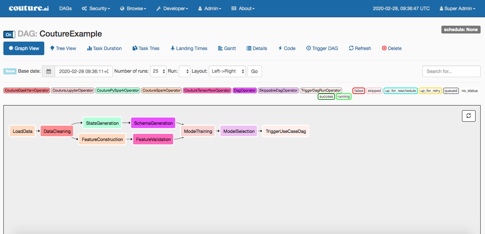

### Importing Modules:

Let's start by importing the libraries we will need.

```python
from airflow.operators.dag_operator import DagOperator
```

### Linking DAGs

An object should be instantiated from `DagOperator`. The first argument `task_id` acts as a unique identifier for the task.

```python
schema_generation = DagOperator(
    task_id='SchemaGeneration',
    run_dag_id="ExampleSchemaGeneration",
    python_callable=conditionally_trigger,
    params={'condition_param': True, 'message': 'Hii there!!'},
    dag=dag,
)
```

### Conditionally trigger DAGs

A condition can be set as to whether or not to trigger the remote `DAG`, by defining a `python function` as below.

```python
def conditionally_trigger(context, dag_run_obj):
    """This function decides whether or not to Trigger the remote DAG"""
    if context['params']['condition_param']:
        dag_run_obj.payload = {'message': context['params']['message']}
        return dag_run_obj

```

**Note**: All the dags which are part of master dag, should be **ON**.

### Zoom into DAG

The `dags` which are part of `master dag`, can be visited by clicking on them and then clicking on `Zoom into DAG`. Their preview can be seen by hovering on the button `Zoom into DAG` .

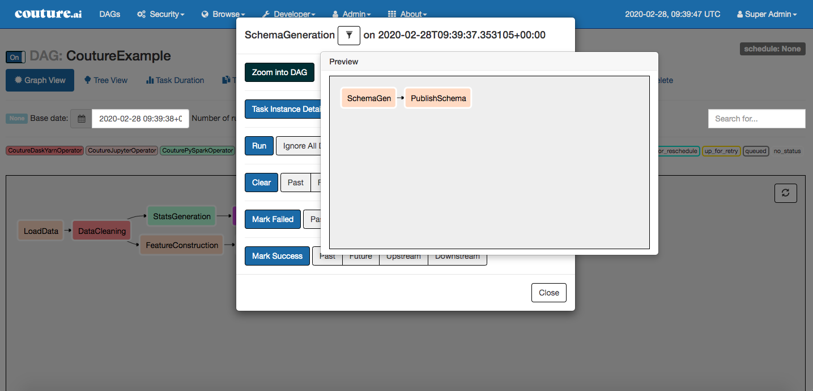


## Import/Export `Hadoop/Spark Configurations, Spark Dependencies, DAGS`

Workflow provides `API` to directly import/export various `configurations`, `DAGS` etc. How to use such `APIs` is listed below.

- Import/Export  `Hadoop/Spark` Configurations

  We can import and export our `hadoop configuration groups`, and our `spark configurations ` using curl commands via an `API`:

  - To export `configs`:

    ```bash
    curl --location --request POST 'http://<server-ip>:8080/api/configs/' \
    		--header 'Content-Type: multipart/form-data' \
    		--form 'sources=@/path/to/configs.tar.gz'
    ```


  - To import `configs` to server:

    ```bash
    curl --location --request POST 'http://<server-ip>:8080/api/configs/' \
    --header 'Content-Type: multipart/form-data' \
    --form 'sources=@/path/to/configs.tar.gz'
    ```

- Import/Export `Spark` Dependencies

  - To export `dependencies`:

    ```bash
    	curl --location --request GET 'http://<server-ip>:8080/api/dependencies/' > dependencies.tar.gz
    ```

  - To import `dependencies ` to server:

    ```bash
    curl --location --request POST 'http://<server-ip>:8080/api/dependencies/' \
    		--header 'Content-Type: multipart/form-data' \
    		--form 'sources=@/path/to/dependencies.tar.gz'
    ```

- Import/Export `DAGS`

  - To export `DAGS`:

    ```bash
    curl --location --request GET 'http://<server-ip>:8080/api/dags/' > dags.tar.gz

    ```

  - To import `DAGS`:

    ```bash
    curl --location --request POST 'http://<server-ip>:8080/api/dags/' \
    		--header 'Content-Type: multipart/form-data' \
    		--form 'sources=@/path/to/dags.tar.gz'
    ```


# Operators

While DAGs describe how to run a workflow, Operators determine what actually gets done by a task.

An operator describes a single task in a workflow. Operators are usually (but not always) atomic, meaning they can stand on their own and don’t need to share resources with any other operators. The DAG will make sure that operators run in the correct order; other than those dependencies, operators generally run independently. In fact, they may run on two completely different machines.

Workflow provides operators for many common tasks, including:
## BashOperator

Use the BashOperator to execute commands in a Bash shell.
```python
from airflow.operators.bash_operator import BashOperator

run_this = BashOperator(
    task_id='run_after_loop',
    bash_command='echo 1',
    dag=dag,
)
```

## PythonOperator

Use the PythonOperator to execute Python callables.
```
def print_context(ds, **kwargs):
    pprint(kwargs)
    print(ds)
    return 'Whatever you return gets printed in the logs'
```


```python
run_this = PythonOperator(
    task_id='print_the_context',
    provide_context=True,
    python_callable=print_context,
    dag=dag,
)
```
## SparkOperator

Use SparkOperator to create and submit a spark job on spark master. Task ID and DAG ID are passed as spark configuration `spark.workflow.taskId` and `spark.workflow.dagId` respectively. Application arguments can be defined here in a list format, which are passed to the main method of the main class, if any.

Name of the application should be passed through 'app_name' . It will be overridden if also defined within the Main class of the application.

For Java and Scala applications, the fully qualified classname of the class containing the main method of the application should be provided through 'class_path'. For example, org.apache.spark.examples.SparkPi

All the configurations defined under Admin -> Spark Configuration are considered while running the application. The developer code should be uploaded through Developer -> Code Artifacts and one can refer the same under 'code_artifact'.

```python
  from airflow.operators import SparkOperator

  LoadData = SparkOperator(
      task_id='LoadData',
      app_name=appName,
      class_path='org.apache.spark.examples.SparkPi',
      code_artifact='spark-examples_2.11-2.3.1.jar',
      application_arguments=[],
      dag=dag,
      description='This task was inserted from the code bricks available on from 				Developer -> Manage Dags. The task name have been updated according to the 				scenario'
  )
```

## CoutureSparkOperator

Use CoutureSparkOperator to create and submit a spark job on spark master. This operator differs from SparkOperator in terms of optional parameters.

Optional Parameters:

- `task_args_dict` : Arguments required for main method of the main class. To be passed in dictionary format.

- `input_base_dir_path` : Base directory path for input files. This has to be a string

- `output_base_dir_path` : Base directory path for output files. This has to be a string

- `input_filenames_dict` : Relative file paths for input files w.r.t input base directory. To be passed in dictionary format.

- `output_filenames_dict` : Relative file paths for output files w.r.t output base directory. To be passed in dictionary format.

  All the optional parameters, if present, are dumped as json which is passed on as string in the main method of main class. Task id and DAG id are also present in this json as `task_id` and `dag_id` respectively.

  Example of final output:

```json
'{"task_id": "fetch_videos", "dag_id": "video_embedding_dag", "task_args_dict": {"task_strategy": "parallel"}, "input_base_dir_path": "/usr/local/couture/input/", "output_base_dir_path": "/usr/local/couture/processed/", "input_filenames_dict": {"tags_file": "video_tags.csv"}, "output_filenames_dict": {"tags_file": "video_tags.csv"}}'
```

  Name of the application should be passed through 'app_name' . It will be overridden if also defined within the Main class of the application.

  For Java and Scala applications, the fully qualified classname of the class containing the main method of the application should be provided through 'class_path'. For example, org.apache.spark.examples.SparkPi

  All the configurations defined under Admin -> Spark Configuration are considered while running the application. The developer code should be uploaded through Developer -> Code Artifacts and one can refer the same under 'code_artifact'.

  ```python
    from airflow.operators import CoutureSparkOperator
  
    LoadData = CoutureSparkOperator(
        task_id='LoadData',
        app_name=appName,
        class_path='org.apache.spark.examples.SparkPi',
        code_artifact='spark-examples_2.11-2.3.1.jar',
        input_base_dir_path="/usr/local/couture/input/",
    		output_base_dir_path="/usr/local/couture/processed/",
    		output_filenames_dict={'tags_file': "video_tags.csv"},
    		input_filenames_dict={'tags_file': "video_tags.csv"},
    		task_args_dict={'task_strategy': "parallel"},
        dag=dag,
        description='This task was inserted from the code bricks available on from 					Developer -> Manage Dags. The task name have been updated according to the 					scenario'
    )
  ```

## CoutureDaskYarnOperator

Dask-Yarn deploys Dask on [YARN](https://hadoop.apache.org/docs/current/hadoop-yarn/hadoop-yarn-site/YARN.html) clusters and mark the worflow task pass/fail according to the run status of the job.

Optional Parameters:

- `task_args_dict` : Arguments required for main method of the main class. To be passed in dictionary format.

- `input_base_dir_path` : Base directory path for input files. This has to be a string

- `output_base_dir_path` : Base directory path for output files. This has to be a string

- `input_filenames_dict` : Relative file paths for input files w.r.t input base directory. To be passed in dictionary format.

- `output_filenames_dict` : Relative file paths for output files w.r.t output base directory. To be passed in dictionary format.

  All the optional parameters, if present, are dumped as json which is passed on as string in the main method of main class. Task id and DAG id are also present in this json as `task_id` and `dag_id` respectively.

  Example of final output:

  ```json
  '{"task_id": "fetch_videos", "dag_id": "video_embedding_dag", "task_args_dict": {"task_strategy": "parallel"}, "input_base_dir_path": "/usr/local/couture/input/", "output_base_dir_path": "/usr/local/couture/processed/", "input_filenames_dict": {"tags_file": "video_tags.csv"}, "output_filenames_dict": {"tags_file": "video_tags.csv"}}'
  ```

 Name of the application should be passed through 'app_name' . It will be overridden if also defined within the Main class of the application.

  The developer code should be uploaded through Developer -> Code Artifacts and one can refer the same under 'code_artifact'.

```python
  from airflow.operators import CoutureDaskYarnOperator

DataCleaning = CoutureDaskYarnOperator(
    task_id='DataCleaning',
    app_name=appName,
    code_artifact='spark-examples_2.11-2.3.1.jar',
    dag=dag,
    description='This task was inserted from the code bricks available on from 				Developer -> Manage Dags. The task name have been updated according to the 			 scenario'
)
```

## PySparkOperator

Use PySparkOperator to create and submit a pyspark job on spark master. Task ID and DAG ID are passed as spark configuration 'spark.workflow.taskId' and 'spark.workflow.dagId' respectively. Application arguments can be defined here in a list format, which are passed to the main method of the main class, if any.

Name of the application should be passed through 'app_name' . It will be overridden if also defined within the Main class of the application.

All the 'Arguments' defined under Admin -> Spark Configuration are considered while running the application. The developer code should be uploaded through Developer -> Code Artifacts and one can refer the same under 'code_artifact'.

```python
from airflow.operators import PySparkOperator

StatsGeneration = PySparkOperator(
    task_id='StatsGeneration',
    app_name=appName,
    code_artifact='pi.py',
    application_arguments=[],
    dag=dag,
    description='Stats Generation'
)
```

## CouturePySparkOperator

Use CouturePySparkOperator to create and submit a pyspark job on spark master. This operator differs from PySparkOperator in terms of optional parameters.

Optional Parameters:

- `task_args_dict` : Arguments required for main method of the main class. To be passed in dictionary format.

- `input_base_dir_path` : Base directory path for input files. This has to be a string

- `output_base_dir_path` : Base directory path for output files. This has to be a string

- `input_filenames_dict` : Relative file paths for input files w.r.t input base directory. To be passed in dictionary format.

- `output_filenames_dict` : Relative file paths for output files w.r.t output base directory. To be passed in dictionary format.

  All the optional parameters, if present, are dumped as json which is passed on as string in the main method of main class. Task id and DAG id are also present in this json as `task_id` and `dag_id` respectively.

  Example of final output:

  ```json
  '{"task_id": "fetch_videos", "dag_id": "video_embedding_dag", "task_args_dict": {"task_strategy": "parallel"}, "input_base_dir_path": "/usr/local/couture/input/", "output_base_dir_path": "/usr/local/couture/processed/", "input_filenames_dict": {"tags_file": "video_tags.csv"}, "output_filenames_dict": {"tags_file": "video_tags.csv"}}'
  ```


  Name of the application should be passed through 'app_name' . It will be overridden if also defined within the Main class of the application.

  All the 'Arguments' defined under Admin -> Spark Configuration are considered while running the application. The developer code should be uploaded through Developer -> Code Artifacts and one can refer the same under 'code_artifact'.

  ```python
  from airflow.operators import CouturePySparkOperator
  
  StatsGeneration = CouturePySparkOperator(
      task_id='StatsGeneration',
      app_name=appName,
      code_artifact='pi.py',
      input_base_dir_path="/usr/local/couture/input/",
      output_base_dir_path="/usr/local/couture/processed/",
      output_filenames_dict={'tags_file': "video_tags.csv"},
      input_filenames_dict={'tags_file': "video_tags.csv"},
      task_args_dict={'task_strategy': "parallel"},
      dag=dag,
      description='Stats Generation'
  )
  ```

## TensorflowOperator

Use TensorflowOperator to run a tensorflow task. 

The developer code should be uploaded through Developer -> Code Artifacts and one can refer the same under 'code_artifact'. Application arguments can be defined here in a string format, which are passed to the main method of the main class, if any.

``` python
from airflow.operators import TensorflowOperator

FeatureValidation = TensorflowOperator(
    task_id='FeatureValidation',
    code_artifact='pi.py',
    application_arguments="",
    dag=dag,
    description='Feature Validation'
)
```

## CoutureTensorflowOperator

Use CoutureTensorflowOperator to run a tensorflow task. This operator differs from TensorflowOperator in terms of optional parameters.

Optional Parameters:

- `task_args_dict` : Arguments required for main method of the main class. To be passed in dictionary format.

- `input_base_dir_path` : Base directory path for input files. This has to be a string

- `output_base_dir_path` : Base directory path for output files. This has to be a string

- `input_filenames_dict` : Relative file paths for input files w.r.t input base directory. To be passed in dictionary format.

- `output_filenames_dict` : Relative file paths for output files w.r.t output base directory. To be passed in dictionary format.

  All the optional parameters, if present, are dumped as json which is passed on as string in the main method of main class. Task id and DAG id are also present in this json as `task_id` and `dag_id` respectively.

  Example of final output:

  ```json
  '{"task_id": "fetch_videos", "dag_id": "video_embedding_dag", "task_args_dict": {"task_strategy": "parallel"}, "input_base_dir_path": "/usr/local/couture/input/", "output_base_dir_path": "/usr/local/couture/processed/", "input_filenames_dict": {"tags_file": "video_tags.csv"}, "output_filenames_dict": {"tags_file": "video_tags.csv"}}'
  ```

The developer code should be uploaded through Developer -> Code Artifacts and one can refer the same under 'code_artifact'.

```python
from airflow.operators import CoutureTensorflowOperator

fetch_videos = CoutureTensorflowOperator(
    dag=dag,
    task_id='fetch_videos',
    code_artifact=code_artifact,
    input_base_dir_path=input_dir,
    output_base_dir_path=processed_dir,
    output_filenames_dict={'tags_file': "video_tags.csv"},
    input_filenames_dict={'tags_file': "video_tags.csv"},
    task_args_dict={'task_strategy': "parallel"},
    description='A TF task'
    )
```

## CoutureJupyterOperator

<a name="couture-jupyter-operator"></a>

You can schedule `.ipynb` notebooks to run in workflow by using the `CoutureJupyterNotebook` operator. You can also `parameterize` the notebook. To do this, tag notebook cells with `parameters`. These parameters are later used when the notebook is executed or run.

- Adding tags to a notebook:

  1.	Open the `notebook` on which you want to add tags.
  2.	Activate the tagging toolbar by navigating to `View, Cell Toolbar, and then Tags`.
  3.	Enter parameters into a textbox at the top right of a cell
  4.	Click Add Tag.

  

- How parameters work:

  1. The `parameters` cell is assumed to specify default values which may be overridden by values specified at execution time.
  2. We insert a new cell tagged `injected-parameters` immediately after the `parameters` cell which contains only the overridden parameters.
  3. Subsequent cells are treated as normal cells, even if also tagged parameters
     if no cell is tagged parameters, the injected-parameters cell is inserted at the top of the notebook.
  4. One caveat is that a `parameters` cell may not behave intuitively with inter-dependent parameters. Consider a notebook note.ipynb with two cells:

  ```python
  # parameters
  a = 1
  twice = a * 2
  print("a =", a, "and twice =", twice)
  ```

  when executed with parameters `{"a": 9 }`, the output will be ` a = 9` and `twice = 2`. (not twice=18).

*Example code*

```python
from airflow import DAG
from airflow.operators.jupyter_operator import CoutureJupyterOperator
from datetime import datetime, timedelta


default_args = {
    'owner': 'Airflow',
    'depends_on_past': False,
    'start_date': datetime(2019, 1, 1),
    'email': ['airflow@example.com'],
    'email_on_failure': False,
    'email_on_retry': False,
    'retries': 1,
    'retry_delay': timedelta(minutes=5),
}

dag = DAG('JupyterDAG', default_args=default_args, schedule_interval=timedelta(days=10))

# t1 is an example of task created by instantiating CoutureJupyterOperator.
# input_nb and output_nb are notebook paths.
t1 = CoutureJupyterOperator(task_id='jupyter_task',
                            input_nb='testFile2.ipynb',
                            output_nb='plotTestFile2.ipynb',
                            parameters={"a": 10},
                            export_html=False,
                            dag=dag)
```

# User Interface

The Workflow UI makes it easy to monitor and troubleshoot your data pipelines. Here's a quick overview of some of the features and visualizations you can find in the Workflow UI.

## View DAGs

List of the `DAGs` in your environment, and a set of shortcuts to useful pages. You can see exactly how many tasks succeeded, failed, or are currently running at a glance. In the top navigation bar, click on `DAGs`, situated near the `COUTURE.AI` logo on the top left side.

## Tree View

A` tree` representation of the `DAG` that spans across time. If a `pipeline` is late, you can quickly see where the different steps are and identify the blocking ones.

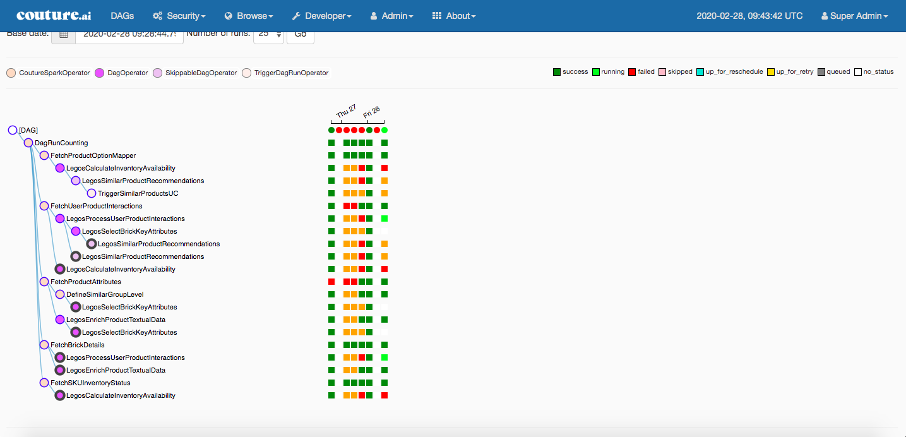

## Graph View

The `graph` view is perhaps the most comprehensive. Visualize your `DAG's` dependencies and their current status for a specific run.

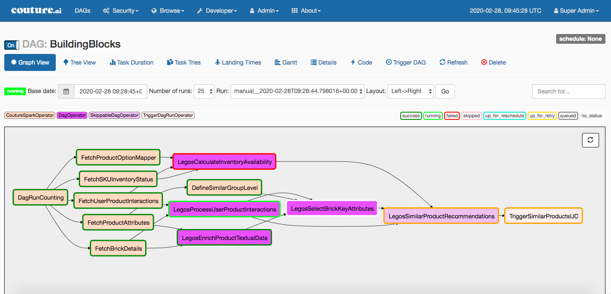

Here is the screenshot of the `DAG` executed. You can see rectangular boxes representing a `task`. You can also see different color boxes on the top right of the greyed box, named: `success, running, failed` etc, representing `status` of the `task`. 

## Variable View

The variable view allows you to `list, create, edit` or `delete` the key-value pair of a `variable` used during `jobs`. Value of a variable will be hidden if the key contains any words in `('password', 'secret', 'passwd', 'authorization', 'api_key', 'apikey', 'access_token')` by default, but can be configured to show in clear-text.

## Gantt Chart

The Gantt chart lets you analyse task duration and overlap. You can quickly identify bottlenecks and where the bulk of the time is spent for specific `DAG` runs.

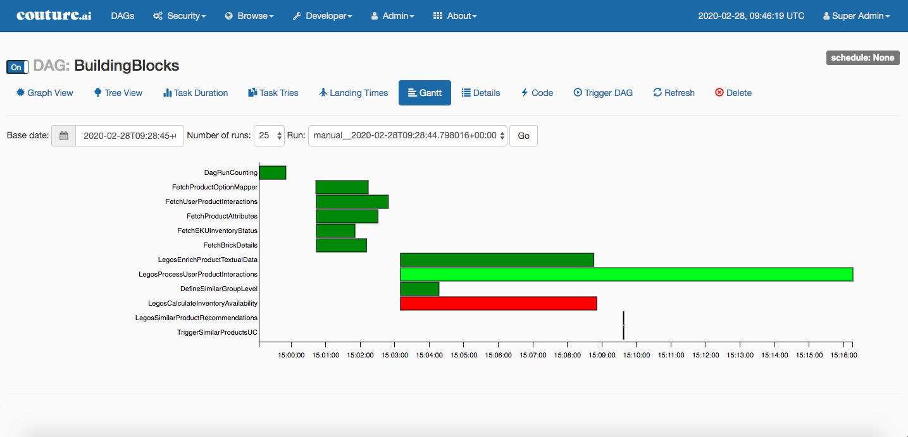

## Task Duration

The duration of your different tasks over the past `N` runs. This view lets you find outliers and quickly understand where the time is spent in your DAG over many runs.

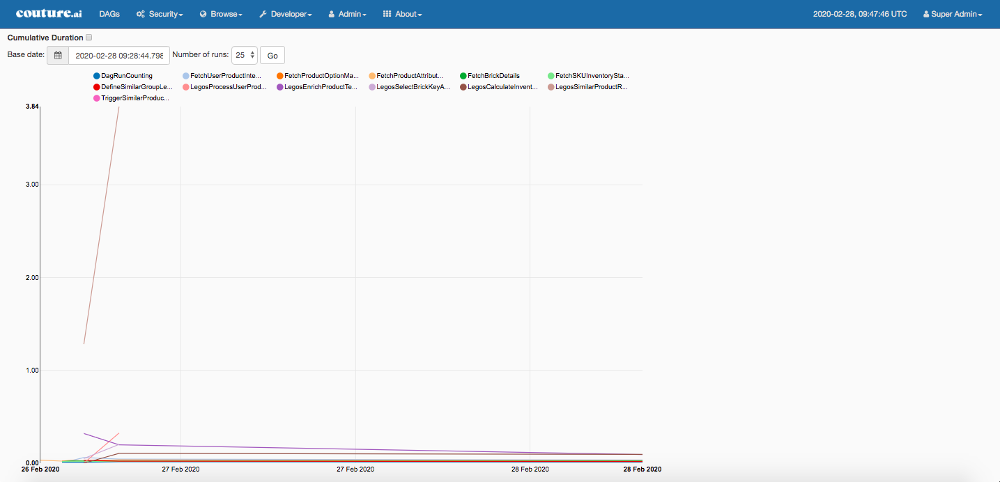

## Code View

Transparency is everything. While the `code` for your pipeline is in source control, this is a quick way to get to the code that generates the DAG and provide yet more context.

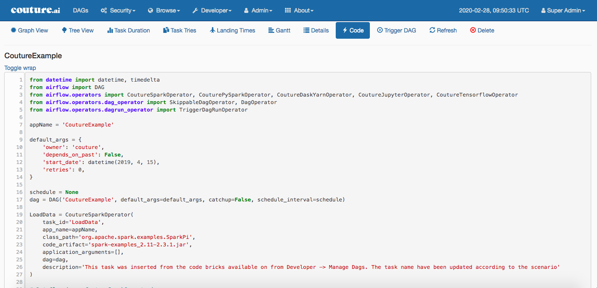

## Task Instance Context Menu

From the pages seen above (tree view, graph view, gantt, ...), it is always possible to click on a task instance, and get to this rich context menu that can take you to more detailed metadata, and perform some actions.

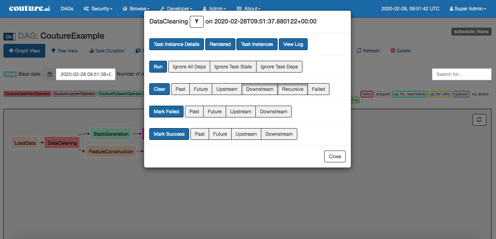

# Users

## Role Based Access Control

Workflow provides `role-based access control (RBAC)`, allowing you to configure varying levels of access across all Users within your Workspace.

There are six roles created for Workflow by default: `Admin, Developer, User, Op, Viewer, and Public`. 

-   #### Admin

`Admin` users have all possible permissions, including granting or revoking permissions from other users.

-   #### Public

`Public` users (anonymous) don't have any permissions.

-   #### Viewer

`Viewer` users have limited viewer permissions

```python
VIEWER_PERMS = {
    'menu_access',
    'can_index',
    'can_list',
    'can_show',
    'can_chart',
    'can_dag_stats',
    'can_dag_details',
    'can_task_stats',
    'can_code',
    'can_log',
    'can_get_logs_with_metadata',
    'can_tries',
    'can_graph',
    'can_tree',
    'can_task',
    'can_task_instances',
    'can_xcom',
    'can_gantt',
    'can_landing_times',
    'can_duration',
    'can_blocked',
    'can_rendered',
    'can_pickle_info',
    'can_version',
}
```

on limited web views.

```python
VIEWER_VMS = {
    'Airflow',
    'DagModelView',
    'Browse',
    'DAG Runs',
    'DagRunModelView',
    'Task Instances',
    'TaskInstanceModelView',
    'SLA Misses',
    'SlaMissModelView',
    'Jobs',
    'JobModelView',
    'Logs',
    'LogModelView',
    'Docs',
    'Documentation',
    'GitHub',
    'About',
    'Version',
    'VersionView',
}
```

-   #### User

`User` users have `Viewer` permissions plus additional user permissions.

```python
USER_PERMS = {
    'can_dagrun_clear',
    'can_run',
    'can_trigger',
    'can_add',
    'can_edit',
    'can_delete',
    'can_paused',
    'can_refresh',
    'can_success',
    'muldelete',
    'set_failed',
    'set_running',
    'set_success',
    'clear',
    'can_clear',
}
```

on `User` web views which is the same as `Viewer` web views.

-   #### Developer

`Developer` users have `User` permissions plus additional developer permissions like access to` jupyter notebook`, `uploading code aritfacts option`, `editing dags privileges`.

-   #### Op

`Op` users have` User` permissions plus additional op permissions.

```python
OP_PERMS = {
    'can_conf',
    'can_varimport',
}
```

on `User` web views plus these additional op web views.

```python
OP_VMS = {
    'Admin',
    'Configurations',
    'ConfigurationView',
    'Connections',
    'ConnectionModelView',
    'Pools',
    'PoolModelView',
    'Variables',
    'VariableModelView',
    'XComs',
    'XComModelView',
}
```

The `Admin` could create a specific role which is only allowed to `read/write` certain` DAGs`. To configure a new role, go to Security tab and click List Roles in the new UI.

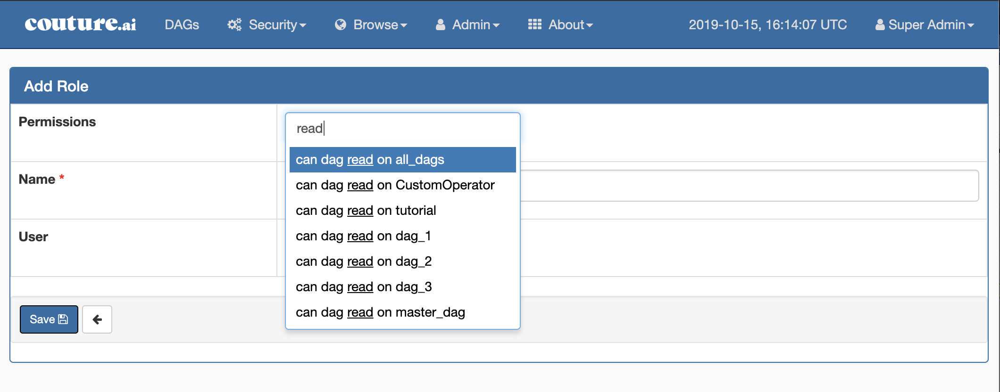

The image shows the creation of a role which can only read all dags.

## User creation

To add new `user`, go to `Security` tab and click `List Users` in the `UI`. This can also be integrated with `Kerberos` or `LDAP`.

To add new user, click the '+' as shown below.

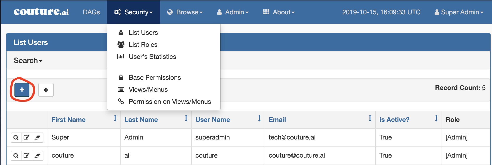

**Note:** Only admin can create new users.

# Access Audit Logging

`User` journey can be easily tracked by audit logs. Audit logs can be viewed by going to `Browse` and clicking on Audit Logs. All the activities/events are captured. Also, the source `IP address` from where the event occurred is captured as shown below.


# Jupyter Notebook

`Jupyter notebook` can be accessed under `Developer` menu and clicking on 'Jupyter Notebook' option. These feature is available for both `Developer` or `Admin` users.

*NOTE: Jupyter Notebook View might prompt you for authentication. Use the same credentials which was used while logging in to Workflow Orchestrator* 

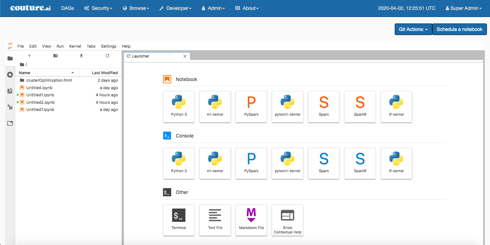

Workflow also has an option to schedule `jupyter notebooks` to run as `DAGs`.  Click on the button `Schedule a notebook`. You can schedule to run it once or provide a cron expression (For example, a cron schedule for running the notebook every 5 minutes is `*/5 * * * *`) to running it periodically. Also, you can add parameters to the notebook by clicking on `Add parameters` which will be injected when the notebook is run. For more info on `parameters`, see [`CoutureJupyterOperator`](#couture-jupyter-operator)

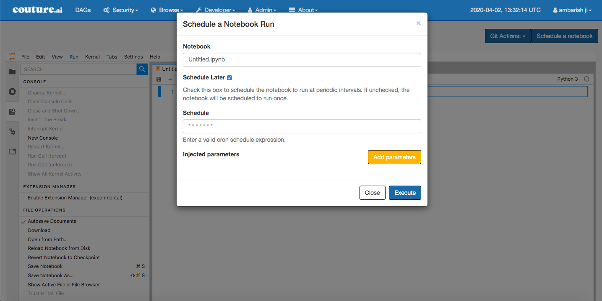

Upon scheduling a notebook, a `Dag` will be dynamically created and you will be redirected to the `DAG` page where you can check the status of your `Notebook run`. This can be used to schedule run notebooks periodically to generate reports etc.

You can also `parameterize` the notebook. To do this, tag notebook cells with `parameters`. These `parameters` are later used when the notebook is executed or run.

## Kernels supported by JupyterHub

Out of the box, Workflow Orchestrator offers support for 7 kernels, including [`sparkmagic`](https://github.com/jupyter-incubator/sparkmagic/) kernels. Sparkmagic is a set of tools for interactively working with remote Spark clusters through [Livy](https://livy.incubator.apache.org/), a Spark REST server, in [Jupyter](http://jupyter.org/) notebooks. 

- `Python3`: A simple python3 kernel, provided by default by jupyterlab.
- `ml-kernel`: A kernel with the most commonly used Machine Learning python packages preinstalled.
- `tf-kernel`: A kernel with `TensorFlow` and commonly used packages preinstalled.
- `pytorch-kernel`: A kernel with `Pytorch` and commonly used packages preinstalled.
- `pySpark`:  Sparkmagic's `pyspark` kernel. 
- `Spark`: Sparkmagic's `spark` kernel.
- `SparkR`: Sparkmagic's `R` kernel.

To configure default  `Livy` Endpoints,  visit [Livy Configuration](#livy-configuration).


# DAG Runs

A `DagRun` is the instance of a `DAG` that will run at a time. When it runs, all task inside it will be executed.

**`DAG Runs`** tell how many times a certain `DAG` has been executed. **`Recent Tasks` **tells which task out of many tasks within a `DAG` currently running and what's the status of it. 

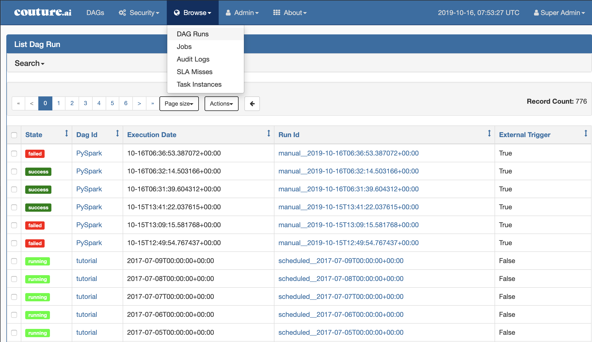

# Trained Models

Workflow Orchestrator allows us to upload Machine Learning models and expose them via an API so that they can be used by clients. Currently, we support 3 different types of models, i.e Tensorflow Models, Spark Models and Other Models. To upload a trained model, visit `Developer->Trained Models`. You will see an UI as attached below:

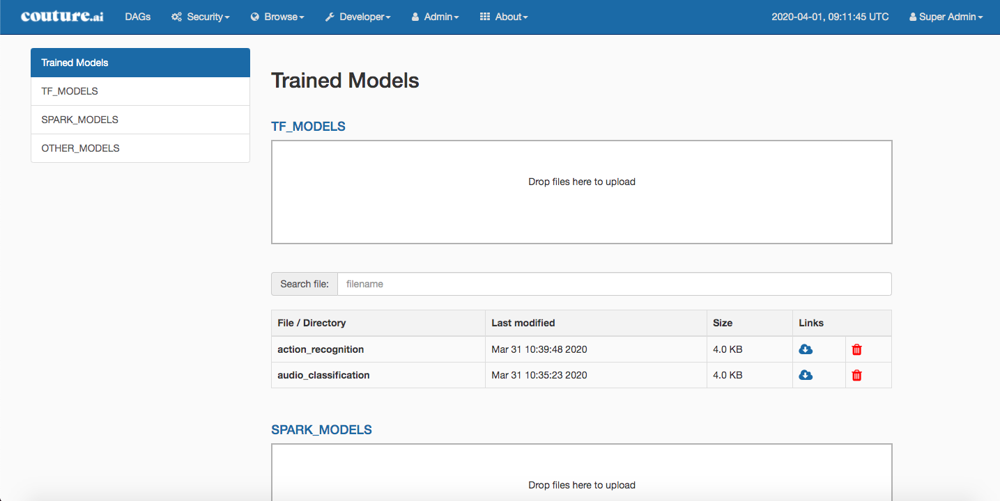

## Default Behavior of different Models

- `Tensorflow Models`: Upload a `.tar` or `.tar.gz` archive of your model. The archive will be extracted in the background, and in < 10 minutes, the model will be exposed via the serving APIs on ports ` 8500` for `gRPC`, `8501` for `REST`. For details on how to access serving APIs, visit [TFX serving guide](https://www.tensorflow.org/tfx/guide/serving). 
- `Spark Models`: Any file can be uploaded in this section. Models added in this section are currently not exposed by an API.
- `Other Models`: There might be some models which you don't want to serve, but might still need. You can upload a `.tar` or `.tar.gz` of your model and the archive will be extracted in the background. However, Models added in this section are not exposed by an API.

# Exploratory Data Analysis

Workflow Orchestrator allows us to add and perform Exploratory Data Analysis (EDA) on a SQL database, TSV or CSV file and HDFS data sources. To perform `EDA` on a data source, go to `Developer->Exploratory Data Analysis`.

## Steps to perform EDA

1. Navigate to `Developer->Exploratory Data Analysis` Page.

2. Add a new Data Source. The data source can be any one of `SQL Database`, `CSV/ TSV`, or `HDFS Source` (optional).

   1. If you select to use `SQL Database`, you will be redirected to `Couture Dashboard`, where you will have to select a table from one of the existing databases from SQL Lab view.

3. Once you have your required Data source added, you need to click on the `play` button to start `EDA`.

   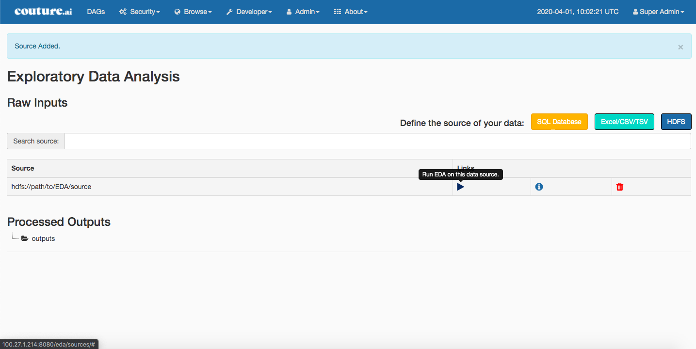

4. Once an output of EDA is generated, it will be in the `Processed Outputs` Section of the same page. Click on the output and you will be redirected to a new tab showing the EDA Results.

# Visualisations

You can directly access `Couture Dashboard` from `Couture Workflow Orchestrator`. To go to Couture Dashboard, from the UI, go to (`Developer`->`Visualisations`). Couture Dashboard is a modern, enterprise-ready business intelligence web application.

Couture Dashboard provides:

- An intuitive interface to explore and visualize datasets, and create interactive dashboards.
- A wide array of beautiful visualizations to showcase your data.
- Easy, code-free, user flows to drill down and slice and dice the data underlying exposed dashboards. The dashboards and charts act as a starting point for deeper analysis.
- A state of the art SQL editor/IDE exposing a rich metadata browser, and an easy workflow to create visualizations out of any result set.
- An extensible, high granularity security model allowing intricate rules on who can access which product features and datasets. Integration with major authentication backends (database, OpenID, LDAP, OAuth, REMOTE_USER, ...)
- A lightweight semantic layer, allowing to control how data sources are exposed to the user by defining dimensions and metrics
- Out of the box support for most SQL-speaking databases
- Deep integration with Druid allows for Superset to stay blazing fast while slicing and dicing large, realtime datasets
- Fast loading dashboards with configurable caching.

# Connections

The connection information to external systems is stored in the workflow metadata database and managed in the UI (`Menu` -\> `Admin` -\> `Connections`). A `conn_id` is defined there and `hostname / login / password /` `schema` information attached to it. Pipelines can simply refer to the centrally managed `conn_id` without having to hard code any of this information anywhere.

Many connections with the same `conn_id` can be defined, workflow will choose one connection randomly, allowing for some basic load balancing and fault tolerance when used in conjunction with `retries`.

# Variables and XComs

## XComs

`XComs` let tasks exchange messages, allowing more nuanced forms of control and shared state. The name is an abbreviation of "cross-communication". Any object that can be pickled can be used as an `XCom` value, so users should make sure to use objects of appropriate size.

`XComs` can be `pushed` (sent) or `pulled` (received). When a task pushes an `XCom`, it makes it generally available to other tasks. Tasks can push `XComs` at any time by calling the `xcom_push()` method. In addition, if a task returns a value (either from its Operator's `execute()` method, or from a `PythonOperator`'s `python_callable` function), then an `XCom` containing that value is automatically pushed.

Tasks call `xcom_pull()` to retrieve `XComs`, optionally applying filters based on criteria like `key, source task_ids,` and source `dag_id`. By default, `xcom_pull()` filters for the keys that are automatically given to `XComs` when they are pushed by being returned from execute functions (as opposed to `XComs` that are pushed manually).

If `xcom_pull` is passed a single string for `task_ids`, then the most recent `XCom` value from that task is returned; if a list of `task_ids` is passed, then a corresponding list of `XCom` values is returned. If you set `provide_context=True`, the returned value of the function is pushed itself into `XCOM` which on itself is nothing but a `DB` table.

```python
# inside a PythonOperator called 'pushing_task'
def push_function():
    return value

# inside another PythonOperator
def pull_function(task_instance):
    value = task_instance.xcom_pull(task_ids='pushing_task')
```

Note that `XComs` are similar to `Variables`, but are specifically designed for inter-task communication rather than global settings.

Example:

```python
def parse_recipes(**kwargs):
  return 'RETURNS parse_recipes'
def download_image(**kwargs):
  ti = kwargs['ti']
  v1 = ti.xcom_pull(key=None, task_ids='parse_recipes')
  print('Printing Task 1 values in Download_image')
  print(v1)
  return 'download_image'
```

The first `task` has no such changes other than providing `**kwargs` which let share `key/value` pairs. The other is setting `provide_context=True` in each operator to make it *XCom compatible*. For instance:

```python
opr_parse_recipes = PythonOperator(task_id='parse_recipes',
                                   python_callable=parse_recipes,
                                   provide_context=True)
```


The `download_image` will have the following changes:

```python
def download_image(**kwargs):
  ti = kwargs['ti']
  v1 = ti.xcom_pull(key=None, task_ids='parse_recipes')
  print('Printing Task 1 values in Download_image')
  print(v1)
  return 'download_image'
```


The first line is `ti=kwargs['t1']` get the instances details by access `ti` key. In case you wonder why this has been done, if you print `kwargs` it prints something like below in which you can find keys like `t1, task_instance` etc to get a task's pushed value.

```python
{'dag': <DAG: parsing_recipes>,
 'ds': '2018-10-02',
 'next_ds': '2018-10-02',
 'prev_ds': '2018-10-02',
 'ds_nodash': '20181002',
 'ts': '2018-10-02T09:56:05.289457+00:00',
 'ts_nodash': '20181002T095605.289457+0000',
 'yesterday_ds': '2018-10-01',
 'yesterday_ds_nodash': '20181001',
 'tomorrow_ds': '2018-10-03',
 'tomorrow_ds_nodash': '20181003',
 'END_DATE': '2018-10-02',
 'end_date': '2018-10-02',
 'dag_run': <DagRunparsing_recipes@2018-10-0209: 56: 05.289457+00: 00: manual__2018-10-02T09: 56: 05.289457+00: 00, externallytriggered: True>,
 'run_id': 'manual__2018-10-02T09:56:05.289457+00:00',
 'execution_date': <Pendulum[2018-10-02T09: 56: 05.289457+00: 00]>,
 'prev_execution_date': datetime.datetime(2018, 10, 2, 9, 56, tzinfo=<TimezoneInfo[UTC, GMT, +00: 00: 00, STD]>),
 'next_execution_date': datetime.datetime(2018, 10, 2, 9, 58, tzinfo=<TimezoneInfo[UTC, GMT, +00: 00: 00, STD]>),
 'latest_date': '2018-10-02',
 'params': {},
 'tables': None,
 'task': <Task(PythonOperator): download_image>,
 'task_instance': <TaskInstance: parsing_recipes.download_image2018-10-02T09: 56: 05.289457+00: 00[running]>,
 'ti': <TaskInstance: parsing_recipes.download_image2018-10-02T09: 56: 05.289457+00: 00[running]>,
 'task_instance_key_str': 'parsing_recipes__download_image__20181002',  'test_mode': False,
 'var': {'value': None, 'json': None},
 'inlets': [],
 'outlets': [],
 'templates_dict': None}
```

Next, `xcom_pull` can be called to put the certain `task's` returned `value`. In my the `task id` is `parse_recipes`:

```python
v1 = ti.xcom_pull(key=None, task_ids='parse_recipes')
```

For each `task`, `xcoms` can be viewed under `View logs` -> `XCom`.

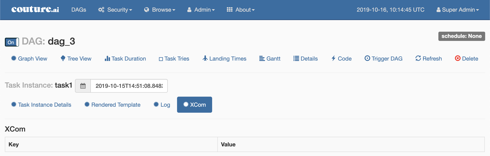

## Variables

`Variables` are a generic way to store and retrieve arbitrary content or settings as a simple `key-value` store within workflow. `Variables` can be listed, created, updated and deleted from the UI. (`Admin` -> `Variables`). In addition, `json` settings files can be bulk uploaded through the UI. While your pipeline code definition and most of your `constants` and `variables` should be defined in code and stored in source control, it can be useful to have some variables or configuration items accessible and modifiable through the UI.

```python
from airflow.models import Variable
foo = Variable.get("foo")
bar = Variable.get("bar", deserialize_json=True)
baz = Variable.get("baz", default_var=None)
```


The second call assumes `json` content and will be deserialized into `bar`. Note that `Variable` is a sqlalchemy model and can be used as such. The third call uses the `default_var` parameter with the value` None`, which either returns an existing value or `None` if the `variable` isn't defined. The get function will throw a `KeyError` if the variable doesn't exist and no default is provided.

`Variables` can be `pushed` and `pulled` in a similar fashion to XComs:

```python
config = Variable.get("db_config")
set_config = Variable.set(db_config)
```


**Note:** Although `variables` are `Fernet` key encrypted in the database, they are accessible in the UI and therefore should **not** be used to store **passwords** or **other sensitive data**.

**When to use each?**

In general , since `XComs` are meant to be used to communicate between tasks and store the \"conditions\" that led to that value being created, they should be used for values that are going to be changing each time a workflow runs.

`Variables` on the other hand are much more natural places for constants like a list of tables that need to be synced, a configuration file that needs to be pulled from, or a list of IDs to dynamically generate tasks from.

Both can be very powerful where appropriate, but can also be dangerous if misused.

# SLAs

`Service Level Agreements`, or time by which a task or `DAG` should have succeeded, can be set at a task level as a timedelta. If one or many instances have not succeeded by that time, an alert email is sent detailing the list of tasks that missed their `SLA`. The event is recorded in the database and made available in the web UI under `Browse`->`SLA Misses` where events can be analyzed and documented.

`SLAs` can be configured for scheduled tasks by using the sla parameter. In addition to sending alerts to the addresses specified in a task's email parameter, the `sla_miss_callback` specifies an additional Callable object to be invoked when the SLA is not met.

